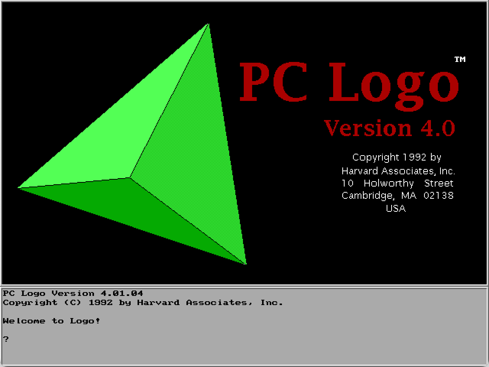

# Rust Logo Interpreter



Interpreter for PC Logo 4.0 written in Rust. My first contact with programming was at the age of 12 when at school we got introduced to Logo and I immediately took a strong liking to it. You write the instructions for the computer, and the computer does them exactly as told. How genius is that!

## Quick start

Clone the repository and run the program with `cargo run`.

## Examples

You can run the example programs. Load the examples with:

`LOAD "LOGO\-EXAMPLES\/IVAN.LGO`.

!(DIJ)[res/dij.png]

```
CS PU SETXY [XCOR - 450 YCOR - 100] PD
DIJ 150 20
```

!(MN)[res/mn.png]

```
CS PU SETXY [XCOR - 300 YCOR - 200] PD
MN 500 4 50
```
